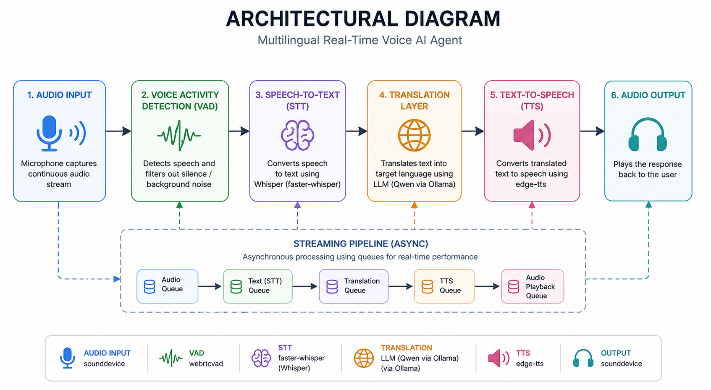

# 🎙️ Multilingual Real-Time Voice AI Agent

This project is a **real-time multilingual voice assistant** that listens to speech (Tamil, Hindi, English), converts it into text, translates it into a target language, and responds back with speech.

It is designed to run on **limited hardware (Intel i5, 16GB RAM)** while maintaining a balance between **performance, accuracy, and real-time interaction**.

## 🚀 What We Built

We developed an **end-to-end AI voice system** with the following pipeline:

Speech → Text → Translation → Speech

The system continuously listens to user input, processes speech in real time, and responds in the selected language.

## 🧠 Why We Built This

Most modern voice AI systems:
- Depend heavily on **cloud APIs**
- Are **costly at scale**
- Do not perform well on **local machines**
- Introduce **high latency**

### 🎯 Objective

To build a system that is:
- 💻 Fully functional on **CPU-only hardware**
- ⚡ Near real-time
- 🧩 Modular and extensible
- 🧠 Architecturally production-ready

## ⚙️ How It Works

The system is composed of independent modules:

1. **Audio Input**
   - Continuously captures microphone input

2. **Voice Activity Detection (VAD)**
   - Detects speech segments
   - Filters silence/noise

3. **Speech-to-Text (STT)**
   - Converts speech into text using Whisper

4. **Translation Layer**
   - Translates text into the target language

5. **Text-to-Speech (TTS)**
   - Generates speech output using edge-tts

6. **Streaming Pipeline**
   - Asynchronous execution for real-time response

## 🏗️ Architecture

## 🧩 Tech Stack

- **Audio Processing**: sounddevice  
- **VAD**: webrtcvad  
- **STT**: faster-whisper  
- **Translation**: LLM (Qwen via Ollama)  
- **TTS**: edge-tts  
- **Async Processing**: asyncio  
- **Package Manager**: uv  

## ⚠️ Current Limitations

- ⏱️ Response time: **~5–7 seconds**
- 🧠 STT struggles with accents and mixed-language input
- 💻 CPU-only limits performance
- 🌐 TTS depends on internet (edge-tts)
- 🔁 LLM introduces additional latency

## ⚡ Root Causes

- Whisper models are **compute-intensive**
- LLM-based translation is **not optimal for speed**
- No GPU acceleration
- Real-time constraints on limited hardware

## 🚀 Future Improvements

### 1. Replace LLM Translation
Use lightweight translation models:
- Faster inference  
- Lower latency  
- Reduced resource usage  

### 2. Improve STT Accuracy
- Upgrade to **Whisper small**
- Force language detection (Tamil/Hindi)
- Use better microphone hardware

### 3. Streaming Enhancements
- Process **partial audio chunks**
- Enable **early TTS playback**

### 4. Interrupt Handling
- Allow user to interrupt ongoing responses

### 5. Offline TTS
- Replace edge-tts with a **local TTS engine**

### 6. GPU Acceleration
- Significantly reduce latency

## 🔄 Next-Level Improvements

If rebuilding:

- Replace LLM with **direct translation models**
- Implement **token-level streaming**
- Optimize pipeline for **<1 second latency**
- Introduce **true real-time interaction**

## 🎯 Final Outcome

This project demonstrates:

- A complete **AI voice pipeline**
- Real-time processing using **async architecture**
- Multi-model integration
- Optimization for **low-resource systems**

## 💡 Conclusion

This is a **fully functional AI system**, not just a prototype.

It achieves a strong balance between:
- Performance  
- Accuracy  
- Resource constraints  

and provides a solid foundation for building advanced real-time voice AI applications.
